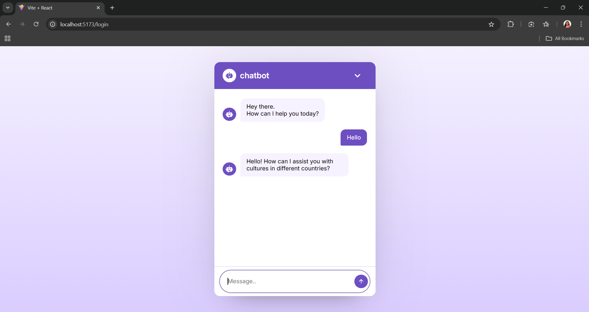

# Chatbot Application

This project is a chatbot application built using React, Express, Node.js, and Azure OpenAI. The chatbot is designed to provide intelligent, context-aware responses to user queries, demonstrating the integration of modern web technologies and AI capabilities.

---

## Features

- **Interactive User Interface**: Developed with React to ensure a dynamic and responsive user experience.
- **Backend Integration**: Built with Node.js and Express to handle API requests and manage application logic.
- **AI-Powered Responses**: Utilizes Azure OpenAI for generating intelligent, human-like replies.
- **Scalability**: Designed with modular components for easy scaling and feature enhancement.

---

## Prerequisites

Before running the project, ensure you have the following installed:

- **Node.js**: Version 14 or higher
- **npm**: Version 6 or higher
- **Azure Account**: With access to Azure OpenAI resources

---


## Technologies Used

- **Frontend**: React, CSS
- **Backend**: Node.js, Express
- **AI Integration**: Azure OpenAI
- **Hosting**: Localhost (Development)

---

## Installation

1. Clone the repository:
   ```bash
   git clone https://github.com/your-repo/chatbot.git
   ```

2. Navigate to the project directory:
   ```bash
   cd chatbot
   ```

3. Install dependencies for the frontend:
   ```bash
   cd client
   npm install
   ```

4. Install dependencies for the backend:
   ```bash
   cd ../server
   npm install
   ```

---

## Configuration

1. Create a `.env` file in the `server` directory and configure the following variables:
   ```env
   AZURE_OPENAI_API_KEY=your_azure_api_key
   AZURE_OPENAI_ENDPOINT=your_azure_endpoint
   PORT=3000
   ```

2. Update the API URL in the `client` directory to match your backend endpoint.

---

## Running the Application

1. Start the backend server:
   ```bash
   cd server
   npm start
   ```

2. Start the frontend:
   ```bash
   cd client
   npm start
   ```

3. Open your browser and navigate to:
   ```
   http://localhost:3000
   ```

---

## File Structure

```
chatbot/
├── client/         # Frontend application (React)
│   ├── public/
│   ├── src/
│   └── package.json
├── server/         # Backend application (Node.js, Express)
│   ├── routes/
│   ├── controllers/
│   ├── app.js
│   └── package.json
└── README.md       # Documentation
```

---

## Screenshots



---

## Contributing

Contributions are welcome! If you would like to contribute, please fork the repository and submit a pull request.

---

## License

This project is licensed under the MIT License.

---

## Acknowledgements

Special thanks to the contributors and the Azure OpenAI team for making this project possible.

